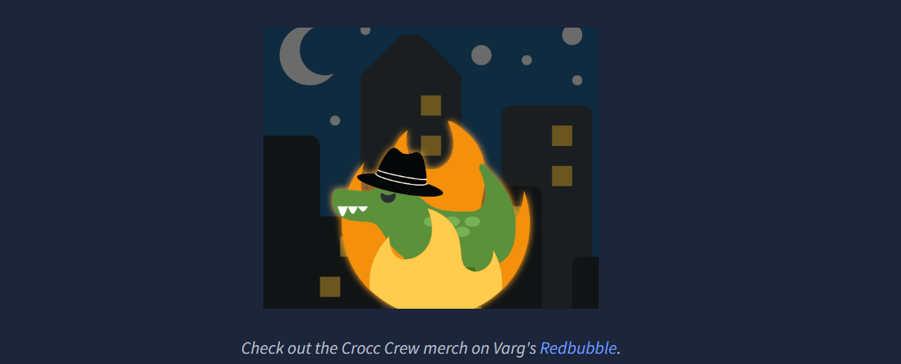

# Crocc Crew

Crocc Crew has created a backdoor on a Cooctus Corp Domain Controller. We're calling in the experts to find the real back door!



Target = 10.129.136.88

## Enumeration

Export the target's IP address as an environment variable 

```jsx
┌──(hackthus💀kali)-[~/Workspace/Tryhackme/New-Crocc_Crew]
└─$ export target=10.129.136.88
```

Network connectivity test 


## Nmap

```jsx
┌──(hackthus💀kali)-[~/Workspace/Tryhackme/New-Crocc_Crew]
└─$ sudo nmap -Pn -p- -sV -sC -O -T4 -v -oA ./Nmap/scan_results $target

PORT      STATE SERVICE       VERSION
53/tcp    open  domain        Simple DNS Plus

80/tcp    open  http          Microsoft IIS httpd 10.0
|_http-server-header: Microsoft-IIS/10.0
| http-methods: 
|   Supported Methods: OPTIONS TRACE GET HEAD POST
|_  Potentially risky methods: TRACE

88/tcp    open  kerberos-sec  Microsoft Windows Kerberos (server time: 2026-04-02 09:14:14Z)
135/tcp   open  msrpc         Microsoft Windows RPC
139/tcp   open  netbios-ssn   Microsoft Windows netbios-ssn
389/tcp   open  ldap          Microsoft Windows Active Directory LDAP (Domain: COOCTUS.CORP0., Site: Default-First-Site-Name)
445/tcp   open  microsoft-ds?
464/tcp   open  kpasswd5?
593/tcp   open  ncacn_http    Microsoft Windows RPC over HTTP 1.0
636/tcp   open  tcpwrapped
3268/tcp  open  ldap          Microsoft Windows Active Directory LDAP (Domain: COOCTUS.CORP0., Site: Default-First-Site-Name)
3269/tcp  open  tcpwrapped

3389/tcp  open  ms-wbt-server Microsoft Terminal Services
| rdp-ntlm-info: 
|   Target_Name: COOCTUS
|   NetBIOS_Domain_Name: COOCTUS
|   NetBIOS_Computer_Name: DC
|   DNS_Domain_Name: COOCTUS.CORP
|   DNS_Computer_Name: DC.COOCTUS.CORP
|   Product_Version: 10.0.17763
|_  System_Time: 2026-04-02T09:15:09+00:00
|_ssl-date: 2026-04-02T09:15:48+00:00; -2s from scanner time.
| ssl-cert: Subject: commonName=DC.COOCTUS.CORP
| Issuer: commonName=DC.COOCTUS.CORP
| Public Key type: rsa
| Public Key bits: 2048
| Signature Algorithm: sha256WithRSAEncryption
| Not valid before: 2026-04-01T08:52:40
| Not valid after:  2026-10-01T08:52:40
| MD5:   7eda:e930:29b0:e34f:ff60:d1e1:8b85:d6ad
|_SHA-1: 34b0:1eb2:b925:9398:7493:2b11:c193:06d3:fd23:2db9

9389/tcp  open  mc-nmf        .NET Message Framing
49666/tcp open  msrpc         Microsoft Windows RPC
49669/tcp open  msrpc         Microsoft Windows RPC
49672/tcp open  ncacn_http    Microsoft Windows RPC over HTTP 1.0
49673/tcp open  msrpc         Microsoft Windows RPC
49677/tcp open  msrpc         Microsoft Windows RPC
49713/tcp open  msrpc         Microsoft Windows RPC
49885/tcp open  msrpc         Microsoft Windows RPC

Warning: OSScan results may be unreliable because we could not find at least 1 open and 1 closed port
Device type: general purpose

Running (JUST GUESSING): Microsoft Windows 2019 (97%)
OS CPE: cpe:/o:microsoft:windows_server_2019
Aggressive OS guesses: Windows Server 2019 (97%)
No exact OS matches for host (test conditions non-ideal).
TCP Sequence Prediction: Difficulty=263 (Good luck!)
IP ID Sequence Generation: Incremental
Service Info: Host: DC; OS: Windows; CPE: cpe:/o:microsoft:windows

Host script results:
| smb2-time: 
|   date: 2026-04-02T09:15:12
|_  start_date: N/A
|_clock-skew: mean: -1s, deviation: 0s, median: -2s
| smb2-security-mode: 
|   3:1:1: 
|_    Message signing enabled and required
```

Add the domain name to the /etc/hosts file


Connectivity test again


### HTTP (80)

Just a home page  no buttons or features


Nothing relevant in the page's source code !


Let's dig a bit deeper!

File brute force 


File paths listed in the robots.txt file


/db-config.back (We’ll come back to that later) 


/backdoor.php contains a web shell, but we cannot execute commands

Add the subdomain db.cooctus.corp to the /etc/hosts file


Let's go to [http://db.cooctus.corp](http://db.cooctus.corp/) 

We have the same homepage 


Brute force attack on the subdomain db.cooctus.corp
We always get the same results


### SMB (443)

Validation of the credentials found in the /db-config.back file
The credentials are invalid, as can be seen in the screenshot


List of users (null session)


The guest account has been disabled


Brute force doesn't work either


Let's list the shares (anonymous)


No results!

## msrpc (135)

### List of users (null session)


After testing several commands, I ended up listing the permissions, but nothing particularly relevant so far


## RDP(3389)

 NLA (Network Level Authentication) is disabled, so we can access the login interface without having to authenticate first.

Find out more [https://theitbros.com/remote-computer-requires-network-level-authentication-nla/](https://theitbros.com/remote-computer-requires-network-level-authentication-nla/)


Start a session without a user and set the window size to 1280x720.

```jsx
┌──(hackthus💀kali)-[~/Workspace/Tryhackme/New-Crocc_Crew]
└─$ rdesktop -u '' -g 1280x720 $target
```

A pair of login credentials displayed on the login screen


Attempt to log in using the credentials provided

However, the user does not have remote access rights or is not a member of the remote desktop group.


Username and password verification

Your username and password are correct !


List of shares to which the user who has just been compromised has access

We can see a non-standard share (Home) to which the user has read-only (READ ONLY) rights.


Connecting to the Home share and exfiltrating data

Retrieving the user.txt file


Let's retrieve the first user flag  :-) 


Exploring SYSVOL

Nothing particularly relevant here!


What is the name of the account created by Crocc Crew?

 Retrieve users from the LDAP directory and save the results to the ldap-crocccrew.txt file.


Let's apply a filter to the ldap-crocccrew.txt file 

We have found the user created by the administrators (admCroccCrew)


List of users

No sensitive information in the description fields


Let’s save the usernames in a file called users.txt


Data collection for Bloudhound 

Oops! A DNS-related error


DNS configuration

Configure the DC as a DNS server using the --dns-server option and retrieve the data


In Bloodhound, we’ve identified a user who is “kerberoastable”.


Kerberoasting

Request for a TGS ticket on behalf of the password-reset service account


We have a Kerberos TGS hash using RC4-HMAC, which is deprecated  which is actually good news!

 Because that means we could potentially take it offline.

Offline cracking with Hashcat 

```jsx
┌──(hackthus💀kali)-[~/Workspace/Tryhackme/New-Crocc_Crew]
└─$ hashcat -m 13100 kerb-hashes.txt /usr/share/wordlists/rockyou.txt 
```

A successful crack!


Username and password verification

The credentials are valid.


List of shares


Bloodhound shows that the user ‘password-reset’ has forced delegation privileges.

Find out more : [https://www.hackingarticles.in/kerberos-constrained-delegation-exploitation/](https://www.hackingarticles.in/kerberos-constrained-delegation-exploitation/)


Identify configuration errors in delegations using impacket-findDelegation.


Operation 

Let’s obtain a service ticket by impersonating the administrator. 


Export the ticket as an environment variable and check and display the tickets stored in the cache


Dump NTDS database


Pass The hash

Let’s list the root of the system.

We have a non-standard 'Shares' folder; it looks like a shared folder 


Let’s list the contents of this file


We can retrieve the files priv-esc-2.txt and priv-esc.txt and the file 


Retrieving the root.txt flag


THE END 

Mr Hackthus :-)